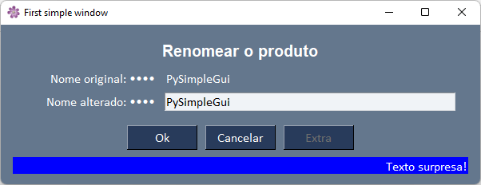

# Sobre o objeto Windows

Este video mostra algumas variacoes que podemos fazer nas janelas alterando os parametros na criacao.
O programa window_final.py cria a seguinte janela:

## Mudando o local da janela principal

location = [x, y]

(x,y) é a localização, em pixels, do canto superior esquerdo da janela na tela.

- O padrão é centralizar na tela.
- Se passar None significa que o sistema operacional decidirá a posição.

## Themas

Mostra todos os temas:

>   sg.preview_all_look_and_feel_themes() 

- mudando temas: https://www.pysimplegui.org/en/latest/cookbook/#making-changes-to-themes-adding-your-own-themes

# Referencias

- [Objeto Windows](https://www.pysimplegui.org/en/latest/call%20reference/#window-the-window-object)
- [temas](https://www.pysimplegui.org/en/latest/cookbook/#themes-window-beautification)

- lista de cores: http://www.wikipython.com/tkinter-ttk-tix/summary-information/colors/