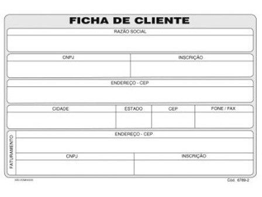

# Elementos básicos de interface para cadastro de pessoa jurídica

Neste folder estao os codigos para criacao de uma interface simples de cadastramento de pessoa juridica que reproduz a "ficha de cliente" mostrada abaixo:

- O interface utiliza um arquivo local para manter os dados preenchidos.
Este metodo é bastante ineficiente mas está sendo mostrado aqui somente para aproveitamos para ver como o Python manipula arquivos JSON.

- Além disto ao preencher o campo de cep, se o endereco estiver em branco, o endereço é preenchido automaticamente buscando o dados de um site na internet.
Este também não é o melhor método, mas exemplifica como usar um webcrawler para extrair informações da internet para seu programa.

