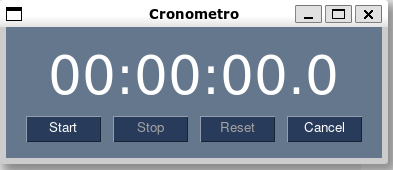
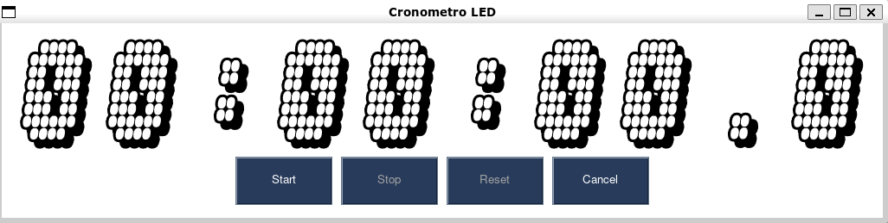

# Cronometro digital

Este folder contem os codigos para criacao de um cronometro digital em Python utilizando PySimpleGUI/

- stopwatch0.py:
  - contem a ideia inicial. Mostra como achar os intervalos de tempo

- stopwatch1.py:
  - contem a classe que gerencia o cronometro somente com os metodos (sem implementação)

- stopwatch.py:
  + cronometro funcional com display em texto normal

- stopwatchled.py:
  + cronometro funcional com display em led

- repeattimer.py:
  - modulo com a classe de Timer que é acionado a cada x décimos de segundo

