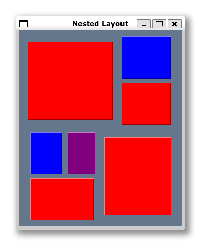

Este é um layout padrão do PySimpleGUI. Você pode colocar dois (ou mais) elementos de tamanhos distintos, um ao lado do outro em uma única linha.

Este é também um layout padrão do PySimpleGUI, pois você pode colocar dois (ou mais) elementos de tamanhos distintos, cada um em uma linha.

As linhas são independentes. Os objetos são colocados um ao lado do outro e alinhados pelo tamanho.
Assim podemos ter a impressão que as colunas possuem quebras, mas na verdade, os elementos são considerados dentro da linha onde são criados.
Por isto vemos os blocos vermelhos como se estivessem em colunas sobrepostas, mas precisamos lembrar que a criação dos elementos é feita por linha.

Isto fica um pouco mais claro neste exemplo. Trocamos o bloco azul da segunda linha por uma columa com duas linhas. Cada linha tem um elemento.
Troque o tamanho destes dois elementos para ver melhor como o alinhamento funciona.
No que os dois novos elementos fazer a altura da segunda linha fique um pouco maior.

Este exemplo reforça a alteração na altura das linhas.

Trocamos o bloco azul da esquerda por duas elementos (na mesma linha). Não é necessário criar uma coluna adicional, pois o PySimpleGUI, sempre permite colocar um objeto ao lado do outro em uma linha.

> 1. Note que os blocos não encostam um no outro. Isto porque existe um default de espaçamento entre objetos em uma janela.
> 2. O tamanho dos botões é definido em caracteres !!!!
