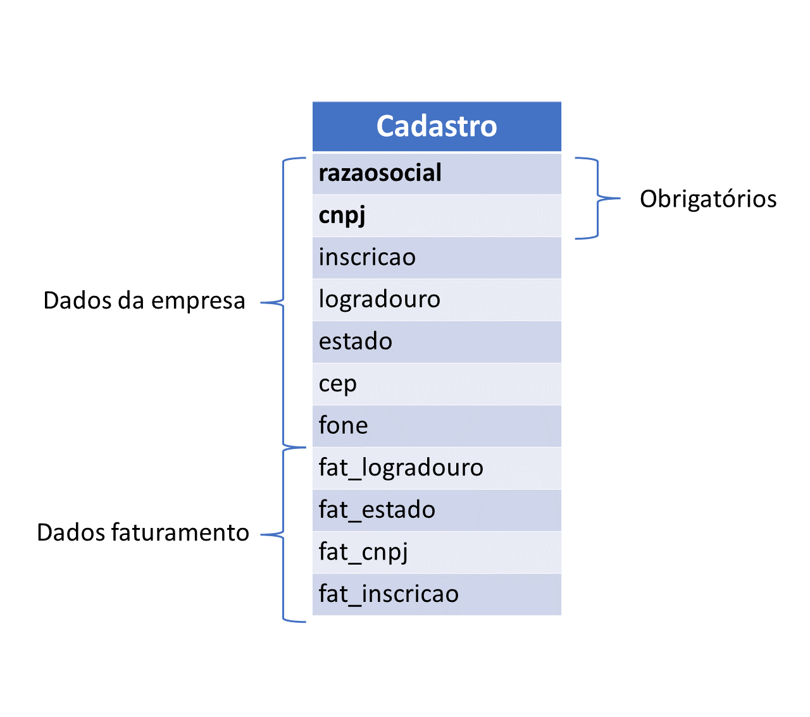
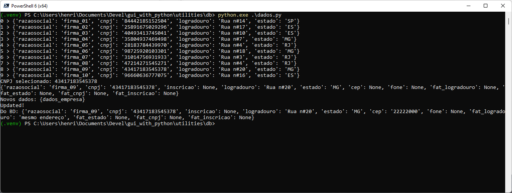

# Classe para manipulação dos dados de cadastro

O módulo python contém uma classe simples que utiliza os recursos do SQLITE3 para gravar e ler dados do cadastro simples mostrado no diretório `4`.

Os dados são:

O programa ao ser executado, cria algumas entradas de teste.
Grava estas entradas no banco de dados `cadastro.db` que surgirá no diretório.
Lê do banco de dados os dados de uma das empresas, altera alguns campos e grava estas alterações no banco de dados.
E por fim lê de novo os dados desta empresa para mostrar que eles foram alterados no banco de dados.
Ao sair o banco de dados é apagado.

